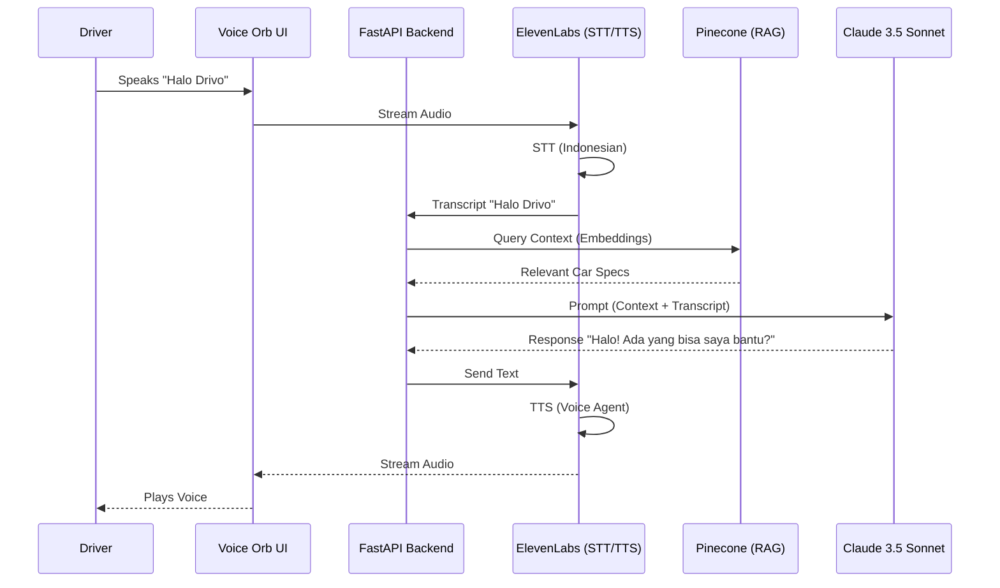
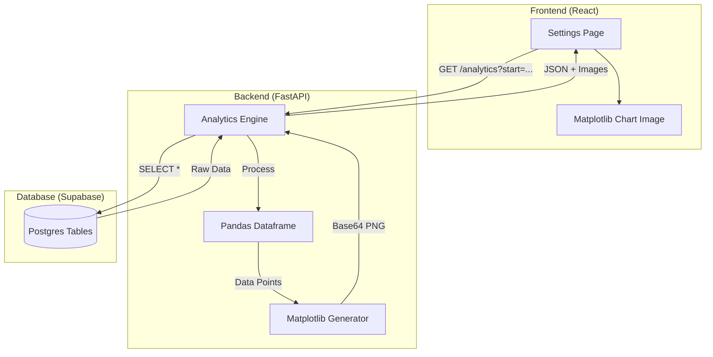
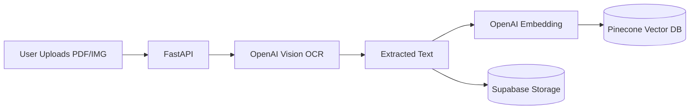

# System Diagrams - Production
## DrivoAI v3.0

---

## 1. Sequence Diagram: Voice Interaction

```mermaid
sequenceDiagram
    participant Driver
    participant UI as Voice Orb UI
    participant BE as FastAPI Backend
    participant EL as ElevenLabs (STT/TTS)
    participant PC as Pinecone (RAG)
    participant LLM as Claude 3.5 Sonnet

    Driver->>UI: Speaks "Halo Drivo"
    UI->>EL: Stream Audio
    EL->>EL: STT (Indonesian)
    EL->>BE: Transcript "Halo Drivo"
    BE->>PC: Query Context (Embeddings)
    PC-->>BE: Relevant Car Specs
    BE->>LLM: Prompt (Context + Transcript)
    LLM-->>BE: Response "Halo! Ada yang bisa saya bantu?"
    BE->>EL: Send Text
    EL->>EL: TTS (Voice Agent)
    EL-->>UI: Stream Audio
    UI-->>Driver: Plays Voice
```

---

## 2. Component Diagram: Analytics Dashboard

```mermaid
graph TD
    subgraph "Frontend (React)"
        SP[Settings Page]
        Chart[Matplotlib Chart Image]
    end

    subgraph "Backend (FastAPI)"
        AE[Analytics Engine]
        MPL[Matplotlib Generator]
        PD[Pandas Dataframe]
    end

    subgraph "Database (Supabase)"
        DB[(Postgres Tables)]
    end

    SP -->|GET /analytics?start=...| AE
    AE -->|SELECT *| DB
    DB -->|Raw Data| AE
    AE -->|Process| PD
    PD -->|Data Points| MPL
    MPL -->|Base64 PNG| AE
    AE -->|JSON + Images| SP
    SP --> Chart
```

---

## 3. Data Flow: Document Ingestion

```mermaid
graph LR
    User[User Uploads PDF/IMG] --> BE[FastAPI]
    BE --> Vision[OpenAI Vision OCR]
    Vision --> Text[Extracted Text]
    Text --> Embed[OpenAI Embedding]
    Embed --> PC[(Pinecone Vector DB)]
    Text --> Storage[(Supabase Storage)]
```
